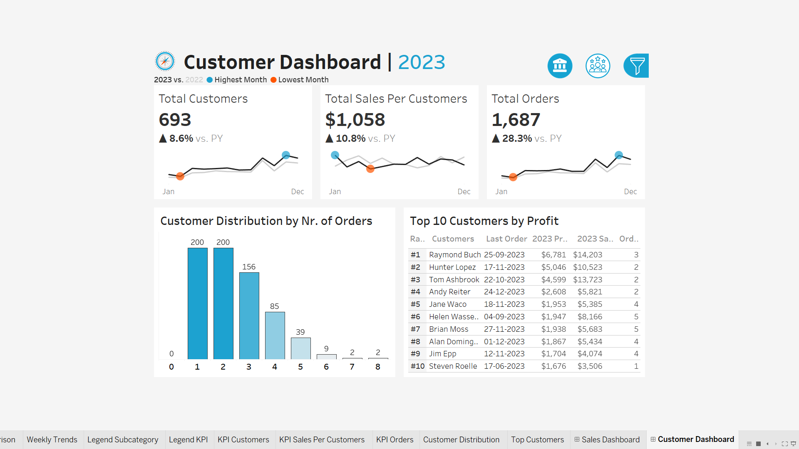

# **Sales and Customer Dashboard**

The purpose of **sales dashboard** is to present an overview of the **sales metrics** and **trends** in order to analyze *year-over-year* sales performance and understand sales trends.

The **customer dashboard** aims to provide an overview of **customer data, trends and behaviors**. It will help marketing teams and management to understand customer segments and improve customer satisfaction.

[**Live Dashboard**](https://public.tableau.com/views/SalesCustomerDashboardsDynamic_17260674432040/SalesDashboard?:language=en-US&:sid=&:redirect=auth&:display_count=n&:origin=viz_share_link)

## **Table of content**
- **Project Overview**
- **Problem Statement/Requirements/Features**
    - **Sales Dahsboard**
    - **Customer Dashboard**
    - **Design & Interactivity Requirements/Features**
- **Dataset**
- **Visualizations/Demo**
- **Technologies Used**
- **Contributing**

## **Project Overview**

This project involves the creation of two interactive Tableau dashboards: a **Sales Dashboard** and a **Customer Dashboard.**

These dashboards are designed to assist stakeholders, including sales managers and executives, in analyzing sales performance and customer behavior. The goal is to provide insights into sales trends, product performance, customer segments, and engagement to drive data-driven decision-making.

## **Problem Statement/Requirements/Features**

## **1. Sales Dashboard** 
- **KPI Overview** : Display a summary of **total sales, profits** and **quantity for the current year and the previous year**.
- **Sales Trends**
    - Present the data for each KPI on a monthly basis for both the current year and the previous year.
    - Identify **months with highest and lowest sales** and make them easy to recognize.
- **Product Subcategory Comparison**
    - Compare **sales performance by different product subcategories** for the current year and the previous year.
    - Include a **comparison of sales with profit**.
- **Weekly Trends for Sales & Profit**
    - Present **weekly sales and profit** data for the current year.
    - Display the **average weekly values**.
    - Highlight *weeks that are above and below the average* to draw attention to sales & profit performance.

## **2. Coustomer Dashboard**
- **KPI Overview** : Display a summary of total number of customers , total sales per customer and total number of orders for the current year and the previous year.
- **Coustomer Trends**
    - Present the data for each KPI on a monthly basis for both the current year and the previous year.
    - Identify **months with highest and lowest sales** and make them easy to recognize.

- **Customer Distribution by Number of Orders**
    - Represent the **distribution of customers** based on the number of orders they have placed to provide **insights into customer behavior, loyalty and engagement**.

- **Top 10 Customers By Profit**
    - Present the **top 10 customers** who have generated the **highest profits for the company**.

    - Show additional information like **rank, number of orders, current sales, current profit and the last order date**.

## **3. Design & Interactivity Requirements/Features**
- **Dashboard Dynamic**
    - The Dashboard should allow users to check historical data by offering them the ***flexibility to select any desired year.***

    - Provide users with the ***ability to navigate between the dashboards easily.***

    - Make the charts and graphs interactive, ***enabling users to filter data using the charts.***
- **Data Filters**
    - **Allow users to filter data by product information like category and subcategory and by location information like region, state and city.**

## **Dataset**
The data is present in 4 csv files, containing **Customer, Location, Orders and Products details.**
### Customer
- Customer ID
- Customer Name
### Location
- Postal Code 
- City 
- State 
- Region
- Country/Region
### Orders
- Order ID
- Order Date 
- Ship Date 
- Ship Mode
- Customer
- Segment 
- Postal Code 
- Product ID
- Sales
- Quantity 
- Discount 
- Profit
### Products
- Product ID
- Category
- Sub Category

To get the Detailed insights,

**Clone the Repository.** The **"Data_insights"** directory contains the **Profile Reports** for each dataset.

## **Visualizations/Demo**

**Customer Dashboard**

**Sales Dahsboard**

**The live [working dashboard](https://public.tableau.com/views/SalesCustomerDashboardsDynamic_17260674432040/SalesDashboard?:language=en-US&:sid=&:redirect=auth&:display_count=n&:origin=viz_share_link).**

## **Technologies Used**
- **Pandas** : To generate insights of the data.
- **Tableau**
- **SQL**

## **Contributing**
**Parshant Kumar**

[**LinkedIn**](www.linkedin.com/in/parshant-kumariiitg)

[**Tableau Public**](https://public.tableau.com/app/profile/parshant.kumar4158)

